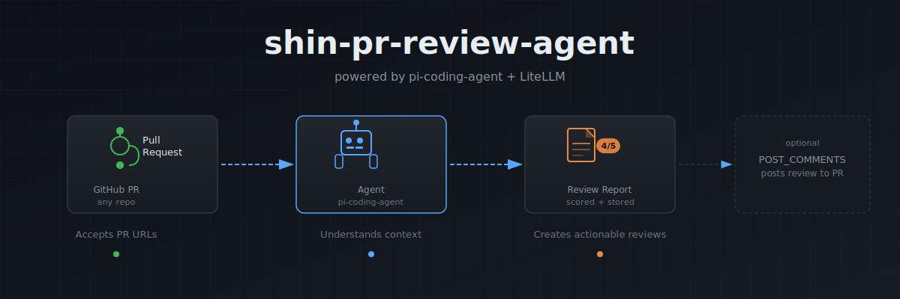

# shin-pr-review-agent



an agent that reviews GitHub PRs: CI triage, diff analysis, and pattern consistency checks, powered by [pi-coding-agent](https://github.com/mariozechner/pi-coding-agent) and LiteLLM.

when `POST_COMMENTS=true`, the agent posts its review directly as a GitHub PR comment.

## Features

- accepts PR URLs via chat UI, API, or OpenAI-compatible endpoint
- runs triage + pattern review pipeline via pi-coding-agent
- stores all review runs in Postgres for history and replay
- serves a `/chat` UI and a `/runs` history view
- exposes `POST /v1/chat/completions` (OpenAI-shaped) for machine callers


## How it works

Two TypeScript scripts gather context before the agent runs. No `GITHUB_TOKEN` needed — all GitHub API calls go through the LiteLLM MCP proxy.

**Triage pass** (`scripts/gather_pr_triage_data.ts`)

Fetches PR metadata and the per-file diff, then resolves all CI check runs (GitHub Actions + CircleCI + classic status API). For each failing check it pulls:

- GitHub annotations (file:line error messages)
- raw job logs (GitHub Actions) or build failure logs (CircleCI), truncated to the failure window
- check results for 3 other open PRs — so the agent knows whether a failure is pre-existing/flaky or specific to this PR

Also extracts the [Greptile](https://greptile.com) confidence score from PR comments if present.

**Pattern pass** (`scripts/gather_pattern_local.ts`)

Uses a local git clone — one `git fetch`, no API rate limits. Diffs the PR against `main`, then for each changed file:

- extracts keywords from the filename/path
- greps the docs tree for those keywords and pulls the nearest heading + surrounding excerpt
- reads the first ~1200 chars of sibling files in the same directory

Then runs conflict detection: compares how the docs and the sibling code handle the same patterns (e.g. `verbose_logger` vs `logging.getLogger`, `httpx.AsyncClient` vs `litellm.module_level_aclient`). Mismatches are surfaced as explicit conflict hints.

The agent gets both JSON blobs and produces a structured review.

## Merge verdict rubric

Every PR is scored on a 5-point scale. Starting from a base of **5/5**, each fired rule docks points. Final score determines the verdict:

| Score | Verdict | Effect |
|-------|---------|--------|
| 5/5 | **READY** | Auto-merged to the staging branch |
| 1–4/5 | **BLOCKED** | Not merged; author notified by bot comment with reasons |
| any | **WAITING** | CI checks still running; bot re-reviews on completion |

### Scoring rules

| Rule | Points docked | Fires when |
|------|--------------|------------|
| `merge_conflicts` | 5 | PR has merge conflicts against the base branch |
| `karpathy` (block) | 5 | Karpathy flags a production or correctness risk it can cite from the diff |
| `pr_related_failures` | 2 | CI failures are specific to this PR (not pre-existing flakiness) |
| `pattern_blocker` | 2 | Pattern pass finds a `blocker`-severity doc violation |
| `pattern_high_risk` | 2 | Pattern pass finds a `high`-risk finding |
| `scope_drift` | 2 | Diff is out of scope relative to the linked issue |
| `unresolved_blocker` | 2 | A prior reviewer comment marked `blocker` is unresolved |
| `karpathy` (needs_human) | 2 | Karpathy cannot resolve the PR on model verdict alone (see below) |
| `pattern_medium_risk` | 1 | Pattern pass finds a `medium`-risk finding |
| `unresolved_concern` | 1 | A prior reviewer comment marked `concern` is unresolved |
| `wide_low_density_fanout` | 1 | PR touches ≥30 files with fewer than 5 lines changed per file on average |
| `greptile_low` | 1 | Greptile confidence score is below 4/5 |
| `greptile_null` | 1 | Greptile has not reviewed the PR yet |

Score is floored at 0. WAITING takes precedence: if any CI check is still running, verdict is always WAITING regardless of score.

### When a PR is flagged for human review

The `karpathy` check returns `needs_human` (-2 pts, verdict = BLOCKED) when it detects judgment calls that model-only scoring cannot resolve confidently:

- **Scope-claim gap**: PR body claims broader coverage than the diff implements (e.g. "all streams", "every endpoint", "cross-provider") but only a subset is actually changed.
- **Multi-route claim, single-route tests**: PR asserts multi-endpoint support but every test fixture hardcodes one route, and cross-endpoint risk is detectable in the diff.

To resolve: either expand the implementation to match the claim, or narrow the PR description to match what the diff actually covers. Push a new commit and the bot re-reviews automatically.

> **Note:** This bot is still in beta and might not always work as expected. Please share any feedback via [Slack](https://join.slack.com/t/litellmossslack/shared_invite/zt-3o7nkuyfr-p_kbNJj8taRfXGgQI1~YyA).

## Setup

```bash
nvm use 20
npm install
cp .env.example .env
# fill in DATABASE_URL, LITELLM_API_BASE, LITELLM_API_KEY
```

Prerequisites: Node **≥20.6**, PostgreSQL. The app applies SQL migrations on startup.

For the pattern pass, point `LITELLM_CLONE_DIR` at a local clone of the repo being reviewed (defaults to `~/Documents/litellm`).

## Usage

```bash
# watch + reload
npm run dev

# production
npm start
```

Default port **8081** (`PORT` overrides).

**Browser:** open `/chat` to talk to the agent, `/runs` to see saved reviews.

**API:**
```bash
curl http://localhost:8081/v1/chat/completions \
  -H "Authorization: Bearer $KEY" \
  -d '{"model":"x","messages":[{"role":"user","content":"review https://github.com/org/repo/pull/123"}]}'
```

## Auth flags

Both default to off — safe to run locally with no gate.

- `ADMIN_USERNAME` / `ADMIN_PASSWORD` — enables login at `/login`
- `BOT_API_KEYS` — comma-separated bearer tokens for API access

No auth env vars set = no gate. Fine on localhost. Do not expose unauthenticated to the public internet.
